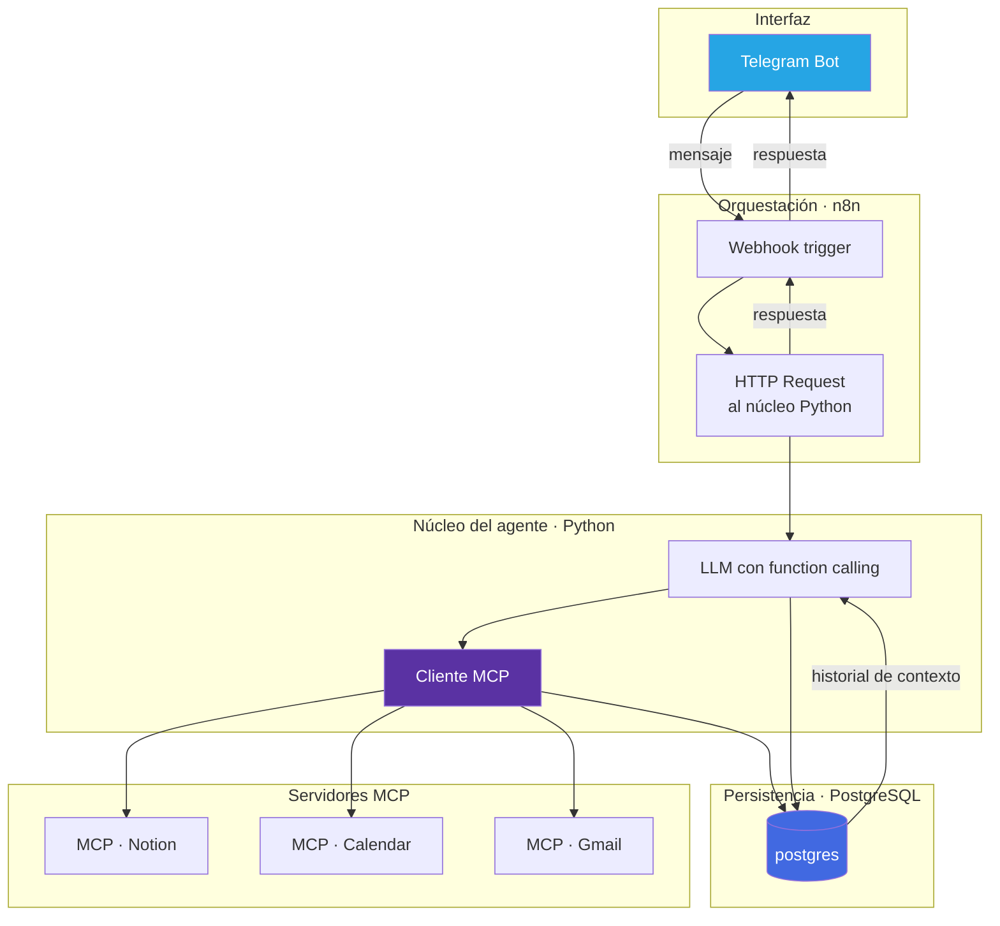

<div align="center">

# 🤖 Agente de Planificación Personal

### Agente conversacional por Telegram · Notion + Google Calendar + Gmail vía MCP · PostgreSQL como memoria persistente

<br>


<br>


</div>

<br>

> **Naturaleza de este documento:** punto de partida. Se refina más adelante con Claude Code y con skills/plugins propios — esto es la foto de intención, no la especificación final. Repo propio, fuera de `ml-agents-data`. Coincide en gran parte con lo que el plan de estudios llama P2 (agente autónomo con herramientas), pero **no está atado a sus plazos ni a sus criterios de evaluación** — reclamar el solape es una decisión aparte, no una obligación de este documento.

---

## 📑 Índice

- [1. Qué es](#1-qué-es)
- [2. Stack confirmado](#2-stack-confirmado)
- [3. El cambio de fondo: MCP como capa de herramientas](#3-el-cambio-de-fondo-mcp-como-capa-de-herramientas)
- [4. Arquitectura de capas](#4-arquitectura-de-capas)
- [5. Modelo de datos](#5-modelo-de-datos-postgresql)
- [6. Estructura de carpetas](#6-estructura-de-carpetas)
- [7. Alcance por fases](#7-alcance-por-fases)
- [8. Personalización: datos personales vs. taxonomía](#8-personalización-datos-personales-vs-taxonomía-del-sistema)
- [9. Instalación: cuatro caminos](#9-instalación-cuatro-caminos-documentados)
- [10. Memoria de conversación](#10-memoria-de-conversación)
- [11. Confirmación ante ambigüedad](#11-confirmación-ante-ambigüedad)
- [12. Nota de open source](#12-nota-de-open-source)
- [13. Historial de decisiones](#13-historial-de-decisiones)
- [Entorno de desarrollo](#-entorno-de-desarrollo)

---

## 1. Qué es

Un agente conversacional, accesible por Telegram, que gestiona planificación personal (tareas, notas, eventos, correo) leyendo y escribiendo en Notion, Google Calendar y Gmail, con PostgreSQL como memoria persistente de todo lo que hace y decide.

---

## 2. Stack confirmado

| Pieza | Rol |
|:---|:---|
| **Python** | Núcleo del agente: lógica de decisión, cliente MCP, glue code |
| **JavaScript** | Nodos Code de n8n; más adelante, un dashboard si hace falta visualizar algo |
| **JSON** | Formato de intercambio entre todas las capas (payloads, definiciones de herramientas, export de workflows) |
| **n8n** | Orquestación: recibe el evento de Telegram, dispara el flujo |
| **PostgreSQL** | Persistencia: conversaciones, llamadas a herramientas, tareas, evaluación |
| **Docker** | Levanta n8n y Postgres en local, reproducible |
| **Telegram** | Interfaz de usuario |
| **Notion, Google Calendar, Gmail** | Herramientas externas, todas accedidas vía **MCP** |

---

## 3. El cambio de fondo: MCP como capa de herramientas

Notion, Calendar y Gmail se acceden vía **MCP** en vez de vía los nodos nativos de n8n. No es un detalle — cambia dónde vive la inteligencia del sistema.

**Qué es MCP aquí:** protocolo estándar por el que un cliente (el agente) pregunta a un servidor MCP qué herramientas ofrece y las invoca de forma uniforme, en vez de que cada integración tenga su propio SDK y su propia autenticación. Mismo concepto que usan Claude Desktop o Claude Code para hablar con Notion, Google Drive, etc.

**Consecuencia arquitectónica:** un cliente MCP necesita vivir en algún sitio que hable el protocolo. n8n no tiene soporte nativo maduro de MCP a día de hoy. Esto significa que **el núcleo Python deja de ser una reescritura futura y pasa a ser necesario desde el principio** — no "lo que ya funciona en n8n, reescrito después", sino la pieza que habla MCP con Notion/Calendar/Gmail desde el día uno. n8n queda con un papel más pequeño: recibir el mensaje de Telegram y llamar al núcleo Python.

---

## 4. Arquitectura de capas



| Capa | Rol |
|:---|:---|
| **Interfaz** | Telegram como único punto de entrada. |
| **Orquestación (n8n)** | Recibe el webhook de Telegram, hace un `HTTP Request` al núcleo Python y devuelve la respuesta. Sin lógica de decisión propia. |
| **Núcleo (Python)** | LLM con function calling + cliente MCP. Es donde vive toda la inteligencia del sistema. |
| **Servidores MCP** | Notion, Calendar y Gmail, cada uno como servidor MCP independiente. |
| **Persistencia** | Postgres registra cada interacción antes de responder: qué se dijo, qué herramienta se llamó, con qué argumentos, qué devolvió, si tuvo éxito. |

---

## 5. Modelo de datos (PostgreSQL)

`llamadas_herramienta` registra explícitamente qué servidor MCP resolvió cada llamada — con tres servidores distintos, saber cuál falla o tarda importa. `conversaciones` ya no gestiona cierre de sesión (ver [§10](#10-memoria-de-conversación)).

```sql
CREATE TABLE usuarios (
    id            SERIAL PRIMARY KEY,
    telegram_id   BIGINT UNIQUE NOT NULL,
    nombre        TEXT NOT NULL,
    creado_en     TIMESTAMPTZ NOT NULL DEFAULT now()
);

CREATE TABLE conversaciones (
    id            SERIAL PRIMARY KEY,
    usuario_id    INTEGER NOT NULL REFERENCES usuarios(id),
    iniciada_en   TIMESTAMPTZ NOT NULL DEFAULT now()
    -- sin cerrada_en: conversación continua por usuario, ver §10
);

CREATE TABLE mensajes (
    id                SERIAL PRIMARY KEY,
    conversacion_id   INTEGER NOT NULL REFERENCES conversaciones(id),
    rol               TEXT NOT NULL CHECK (rol IN ('usuario', 'agente')),
    contenido         TEXT NOT NULL,
    creado_en         TIMESTAMPTZ NOT NULL DEFAULT now()
);

-- servidor_mcp: 'notion' | 'calendar' | 'gmail' | NULL si la
-- herramienta no pasa por MCP (p. ej. consulta interna a Postgres)
CREATE TABLE llamadas_herramienta (
    id              SERIAL PRIMARY KEY,
    mensaje_id      INTEGER NOT NULL REFERENCES mensajes(id),
    servidor_mcp    TEXT,
    herramienta     TEXT NOT NULL,
    argumentos      JSONB NOT NULL,
    resultado       JSONB,
    exito           BOOLEAN NOT NULL,
    latencia_ms     INTEGER,
    creado_en       TIMESTAMPTZ NOT NULL DEFAULT now()
);

CREATE TABLE tareas (
    id                  SERIAL PRIMARY KEY,
    usuario_id          INTEGER NOT NULL REFERENCES usuarios(id),
    titulo              TEXT NOT NULL,
    descripcion         TEXT,
    estado              TEXT NOT NULL DEFAULT 'pendiente'
                         CHECK (estado IN ('pendiente','en_curso','hecha')),
    origen              TEXT NOT NULL CHECK (origen IN ('notion','calendar','gmail')),
    referencia_externa  TEXT,
    fecha_limite        DATE,
    creada_en           TIMESTAMPTZ NOT NULL DEFAULT now(),
    actualizada_en      TIMESTAMPTZ NOT NULL DEFAULT now()
);

CREATE TABLE casos_evaluacion (
    id                    SERIAL PRIMARY KEY,
    prompt                TEXT NOT NULL,
    herramienta_esperada  TEXT NOT NULL,
    herramienta_obtenida  TEXT,
    paso                  BOOLEAN,
    ejecutado_en          TIMESTAMPTZ
);

-- Onboarding conversacional (Fase 0, §7)
CREATE TABLE perfil (
    id                    SERIAL PRIMARY KEY,
    usuario_id            INTEGER NOT NULL REFERENCES usuarios(id),
    que_estudia           TEXT,
    institucion            TEXT,
    onboarding_completo   BOOLEAN NOT NULL DEFAULT false,
    creado_en             TIMESTAMPTZ NOT NULL DEFAULT now()
);

CREATE TABLE asignaturas (
    id            SERIAL PRIMARY KEY,
    usuario_id    INTEGER NOT NULL REFERENCES usuarios(id),
    codigo        TEXT NOT NULL,
    nombre        TEXT,
    creado_en     TIMESTAMPTZ NOT NULL DEFAULT now(),
    UNIQUE(usuario_id, codigo)
);

CREATE TABLE horario_clases (
    id              SERIAL PRIMARY KEY,
    asignatura_id   INTEGER NOT NULL REFERENCES asignaturas(id),
    dia_semana      TEXT NOT NULL CHECK (dia_semana IN
                     ('lunes','martes','miercoles','jueves','viernes','sabado','domingo')),
    hora_inicio     TIME NOT NULL,
    hora_fin        TIME NOT NULL
);

CREATE TABLE examenes (
    id              SERIAL PRIMARY KEY,
    asignatura_id   INTEGER NOT NULL REFERENCES asignaturas(id),
    fecha           DATE NOT NULL,
    tipo            TEXT,
    notas           TEXT
);

-- Taxonomía personalizable del sistema (§8) — sustituye enums fijos
CREATE TABLE taxonomia (
    id            SERIAL PRIMARY KEY,
    usuario_id    INTEGER NOT NULL REFERENCES usuarios(id),
    campo         TEXT NOT NULL CHECK (campo IN
                   ('tipo','prioridad','tiempo_estimado','energia','estado')),
    valor         TEXT NOT NULL,
    orden         INTEGER,
    UNIQUE(usuario_id, campo, valor)
);

-- Confirmación ante ambigüedad (§11)
CREATE TABLE confirmaciones_pendientes (
    id            SERIAL PRIMARY KEY,
    usuario_id    INTEGER NOT NULL REFERENCES usuarios(id),
    candidatos    JSONB NOT NULL,   -- [{"tarea_id": 12, "titulo": "...", "resumen": "..."}]
    accion        TEXT NOT NULL CHECK (accion IN ('editar', 'borrar')),
    creado_en     TIMESTAMPTZ NOT NULL DEFAULT now(),
    resuelto      BOOLEAN NOT NULL DEFAULT false
);
```

> Proyectos no lleva tabla propia en la v1 — se reutiliza `tareas` con `tipo = 'Proyecto'`. Tabla dedicada: sugerencia para cuando el uso real lo pida, no antes.

### Definición de herramienta, generada en tiempo de ejecución

Ningún enum queda fijo en el código. `materia` se construye desde `asignaturas`; `tipo`, `prioridad` y `tiempo_estimado`, desde `taxonomia` — un único mecanismo para todos:

```python
def construir_herramienta_crear_tarea(usuario_id: int) -> dict:
    return {
        "name": "crear_tarea_universidad",
        "parameters": {
            "type": "object",
            "properties": {
                "materia":         {"enum": obtener_asignaturas(usuario_id)},
                "tipo":            {"enum": obtener_taxonomia(usuario_id, "tipo")},
                "prioridad":       {"enum": obtener_taxonomia(usuario_id, "prioridad")},
                "tiempo_estimado": {"enum": obtener_taxonomia(usuario_id, "tiempo_estimado")},
            }
        }
    }
```

Al instalar, un script de siembra (`seed.sql`) inserta valores por defecto en `taxonomia` por cada `campo`. Un comando de personalización (`/personalizar`) hace `INSERT`/`DELETE` sobre esa tabla — nunca toca código ni JSON.

---

## 6. Estructura de carpetas

```
agente-planificador/
├── README.md
├── docker-compose.yml            # postgres + n8n en local
├── db/
│   ├── schema.sql
│   └── seed.sql                  # valores por defecto de taxonomia
├── n8n/
│   └── workflow-agente.json
├── nucleo/                       # el agente Python, cliente MCP
│   ├── agente.py
│   ├── onboarding.py
│   ├── herramientas/
│   │   ├── notion_mcp.py
│   │   ├── calendar_mcp.py
│   │   └── gmail_mcp.py
│   └── evaluacion/
│       └── casos.py
├── docs/
│   ├── DISENO.md
│   ├── instalacion/
│   │   ├── localhost-docker.md
│   │   ├── vps.md
│   │   ├── dispositivo-propio.md
│   │   └── n8n-cloud.md
│   └── decisiones/
└── .env.example
```

---

## 7. Alcance por fases

| Fase | Qué incluye | Por qué en ese orden |
|:---|:---|:---|
| **Fase 0 (agente)** | Onboarding conversacional: perfil, asignaturas, horario, exámenes, proyectos | Sin esto no hay con qué rellenar `materia` ni el resto de enums — es lo que hace que cada instalación se auto-configure sola |
| **Fase 1 (MVP)** | Crear tarea/evento en **To-Do Universidad**, **To-Do del día** o **Calendar**, usando lo aprendido en el onboarding | Esquema ya conocido, mayor valor inmediato |
| **Fase 1.5** *(sugerencia, sin comprometer)* | Sincronizar `horario_clases` con Calendar automáticamente al terminar el onboarding | Candidata natural una vez el resto esté probado — no se mete en el alcance todavía |
| **Fase 2** | Leer y responder consultas ("¿qué tengo pendiente de PBDA esta semana?") | Exige que el agente sepa escribir bien antes de razonar sobre lo que ya existe |
| **Fase 3** | Inbox (captura rápida sin clasificar) + Gmail (leer y redactar) | Inbox es de bajo impacto sin nada maduro debajo; Gmail tiene más fricción de auth |
| **Fuera de alcance, sin fecha** | Habit Tracker, Finance Tracker, Daily Journal, recordatorios proactivos, resumen automático | Cada uno es un dominio de datos distinto que merece su propio diseño, no un añadido apresurado |

> **Regla de salida de fase:** no se empieza la Fase 2 hasta que la Fase 1 funcione de verdad, con casos de evaluación pasando — mismo criterio de dominio que usa el plan de estudios para todo lo demás.

---

## 8. Personalización: datos personales vs. taxonomía del sistema

"Todo personalizable" son dos mecanismos distintos, no uno solo:

| Tipo | Ejemplos | Cuándo se define | Cómo |
|:---|:---|:---|:---|
| **Datos personales** | Materias, horario, exámenes, proyectos | Onboarding (Fase 0) | Conversación obligatoria — no existe otro origen posible |
| **Taxonomía del sistema** | Tipo, Prioridad, Tiempo estimado, Energía requerida | Al instalar, con defaults | Se siembra con valores por defecto; se edita después con un comando, no en la entrevista inicial |

Meter la taxonomía en el onboarding convertiría la primera conversación en un cuestionario de mantenimiento antes de poder crear una sola tarea. Los defaults de siembra son los valores reales del Notion de origen (ya están bien pensados); cualquiera los cambia luego sin tocar código.

---

## 9. Instalación: cuatro caminos documentados

No se elige uno — se documentan los cuatro, cada uno probado literalmente antes de publicarse:

```
docs/instalacion/
├── localhost-docker.md
├── vps.md                    # Hetzner/DigitalOcean como referencia, no exclusivo
├── dispositivo-propio.md     # Raspberry Pi u otro equipo siempre encendido
└── n8n-cloud.md              # n8n de pago, sin autogestionar su contenedor
```

En los tres primeros, n8n corre en Docker junto a Postgres (mismo `docker-compose.yml`). En el cuarto, n8n vive en la nube gestionada y solo Postgres + el núcleo Python corren donde decida el usuario — ese `docker-compose.yml` no incluye el servicio de n8n.

---

## 10. Memoria de conversación

Sin corte explícito de sesión. `conversaciones` deja de decidir cuándo abrir una nueva fila — hay una conversación continua por usuario, y los mensajes se acumulan ahí sin más.

El contexto que se manda al LLM en cada turno es una ventana de los últimos N mensajes por recencia, no todo lo que hay en la conversación abierta.

> **N por defecto: 20 mensajes o las últimas 2 horas, lo que sea menor** — sugerencia sin cifra que la respalde; ajustar según comportamiento en uso real.

---

## 11. Confirmación ante ambigüedad

Cuando el agente detecta que "cámbiale la prioridad" o "borra esa tarea" puede referirse a más de una fila de `tareas`, no actúa. Presenta hasta 3 candidatas y guarda el estado de "esperando que elijas" — el siguiente mensaje de Telegram, por sí solo, no sabe que es la respuesta a esa pregunta.

**Flujo:** cada turno, antes de interpretar el mensaje como petición nueva, el agente comprueba si hay una fila en `confirmaciones_pendientes` sin resolver para ese usuario. Si la hay, el mensaje se interpreta como la elección entre los candidatos mostrados. Si no la hay, sigue el flujo normal.

Esto también cubre `editar_tarea` y `eliminar_tarea` — ambas herramientas pasan siempre por este mecanismo cuando el objetivo no es inequívoco.

---

## 12. Nota de open source

Antes de publicar el repo como público e instalable por terceros, mínimos no negociables:

- `LICENSE` — sugerencia: MIT, default razonable para una utilidad personal sin ambición comercial. Decides tú.
- `.env.example` con **cero valores reales**, ni siquiera de ejemplo plausible.
- README con instrucciones de instalación probadas por alguien que no seas tú, siguiéndolas literalmente y sin ayuda.
- El `enum` de `materia` (§5), hoy sembrado desde onboarding propio, generalizado si se detecta que hace falta leer el esquema real de otro Notion — no es tarea de la Fase 1.

---

## 13. Historial de decisiones

| Pregunta | Respuesta | Implicación de diseño |
|:---|:---|:---|
| Cliente MCP | Núcleo Python | Sin cambios respecto al diseño de [§3](#3-el-cambio-de-fondo-mcp-como-capa-de-herramientas) |
| Usuarios | Open source, instalación independiente por persona | No hace falta aislamiento multi-tenant en la BD; sí un README y `.env.example` que funcionen para un desconocido |
| Features | Basadas en el Second Brain (PARA): Inbox, Weekly Planner, To-Do Universidad, To-Do Proyectos Personales, To-Do del día, Habit Tracker, Finance Tracker, Daily Journal | Demasiado para una v1 — priorizado en [§7](#7-alcance-por-fases) |

---

## 🛠️ Entorno de desarrollo

```bash
# Clonar el repositorio
git clone https://github.com/<usuario>/agente-planificador.git
cd agente-planificador

# Levantar PostgreSQL + n8n local
docker compose up -d

# Aplicar esquema y siembra de taxonomía
psql -h localhost -U postgres -d agente_planificador -f db/schema.sql
psql -h localhost -U postgres -d agente_planificador -f db/seed.sql

# Variables de entorno
cp .env.example .env
# rellenar TELEGRAM_BOT_TOKEN, LLM_API_KEY,
# y las credenciales de cada servidor MCP (Notion, Calendar, Gmail)

# Entorno del núcleo Python
python -m venv .venv
source .venv/bin/activate
pip install -r requirements.txt

# Arrancar el núcleo
python nucleo/agente.py

# Importar el workflow en n8n
# n8n → Import from File → n8n/workflow-agente.json
```

---

<div align="center">

<sub>Agente de Planificación Personal · Documento de diseño v0.2 · Draft · Repo independiente del plan de estudios</sub>

</div>