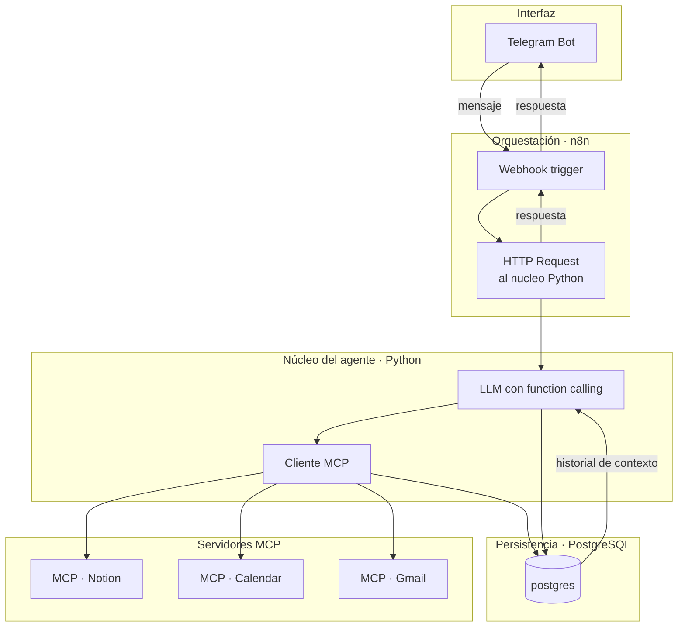

# Agente de Planificación Personal · Documento de Diseño

**Estado:** v0.2 · borrador de idea y estructura inicial
**Repo:** propio, fuera de `ml-agents-data`
**Naturaleza de este documento:** punto de partida. Se refina más adelante con Claude Code
y con tus propios skills/plugins — esto es la foto de intención, no la especificación final.

---

## 1. Qué es

Un agente conversacional, accesible por Telegram, que gestiona tu planificación personal
(tareas, notas, eventos, correo) leyendo y escribiendo en Notion, Google Calendar y Gmail,
con PostgreSQL como memoria persistente de todo lo que hace y decide.

Es un proyecto personal tuyo. Coincide en gran parte con lo que tu plan de estudios llama
P2 (agente autónomo con herramientas), pero no está atado a sus plazos ni a sus criterios de
evaluación — si algún día quieres reclamar el solape, es una decisión tuya, no una obligación
de este documento.

## 2. Stack confirmado

| Pieza | Rol |
|---|---|
| **Python** | Núcleo del agente: lógica de decisión, cliente MCP, glue code |
| **JavaScript** | Nodos Code de n8n; más adelante, un dashboard si hace falta visualizar algo |
| **JSON** | Formato de intercambio entre todas las capas (payloads, definiciones de herramientas, export de workflows) |
| **n8n** | Orquestación: recibe el evento de Telegram, dispara el flujo |
| **PostgreSQL** | Persistencia: conversaciones, llamadas a herramientas, tareas, evaluación |
| **Docker** | Levanta n8n y Postgres en local, reproducible |
| **Telegram** | Interfaz de usuario |
| **Notion, Google Calendar, Gmail** | Herramientas externas, todas accedidas vía **MCP** |

## 3. El cambio de fondo respecto a la v0.1: MCP como capa de herramientas

Pediste explícitamente Notion, Calendar y Gmail vía MCP en vez de vía los nodos nativos de
n8n. Esto no es un detalle — cambia dónde vive la inteligencia del sistema.

**Qué es MCP en este contexto:** un protocolo estándar por el que un cliente (tu agente) le
pregunta a un servidor MCP qué herramientas ofrece y las invoca de forma uniforme, en vez de
que cada integración tenga su propio SDK y su propia forma de autenticarse. Es el mismo
concepto que usan Claude Desktop o Claude Code para hablar con Notion, Google Drive, etc.

**La consecuencia arquitectónica que esto trae:** un cliente MCP necesita vivir en algún
sitio que hable el protocolo. n8n no tiene soporte nativo maduro de MCP todavía (a fecha de
hoy, salvo que hayas visto algo distinto). Eso significa que, casi con seguridad, **el núcleo
Python deja de ser algo que aplazamos y pasa a ser necesario desde el principio** — no como
"reescritura futura de lo que ya funciona en n8n", sino como la pieza que habla MCP con
Notion/Calendar/Gmail desde el primer día. n8n entonces se queda con un papel más pequeño:
recibir el mensaje de Telegram y llamar al núcleo Python.

Esto lo dejo marcado como pregunta abierta en la sección 8 — es lo primero que necesito que
me confirmes antes de que el diseño de capas quede cerrado del todo.

## 4. Arquitectura de capas (versión con MCP)



## 5. Modelo de datos (PostgreSQL)

Igual que en la v0.1, con un ajuste: `llamadas_herramienta` ahora registra explícitamente
por qué servidor MCP se resolvió cada llamada, porque vas a tener tres servidores distintos
y vas a querer saber cuál falla o cuál tarda.

```sql
CREATE TABLE usuarios (
    id            SERIAL PRIMARY KEY,
    telegram_id   BIGINT UNIQUE NOT NULL,
    nombre        TEXT NOT NULL,
    creado_en     TIMESTAMPTZ NOT NULL DEFAULT now()
);

CREATE TABLE conversaciones (
    id            SERIAL PRIMARY KEY,
    usuario_id    INTEGER NOT NULL REFERENCES usuarios(id),
    iniciada_en   TIMESTAMPTZ NOT NULL DEFAULT now()
);

CREATE TABLE mensajes (
    id                SERIAL PRIMARY KEY,
    conversacion_id   INTEGER NOT NULL REFERENCES conversaciones(id),
    rol               TEXT NOT NULL CHECK (rol IN ('usuario', 'agente')),
    contenido         TEXT NOT NULL,
    creado_en         TIMESTAMPTZ NOT NULL DEFAULT now()
);

-- servidor_mcp: 'notion' | 'calendar' | 'gmail' | NULL si la
-- herramienta no pasa por MCP (p. ej. una consulta interna a Postgres)
CREATE TABLE llamadas_herramienta (
    id              SERIAL PRIMARY KEY,
    mensaje_id      INTEGER NOT NULL REFERENCES mensajes(id),
    servidor_mcp    TEXT,
    herramienta     TEXT NOT NULL,
    argumentos      JSONB NOT NULL,
    resultado       JSONB,
    exito           BOOLEAN NOT NULL,
    latencia_ms     INTEGER,
    creado_en       TIMESTAMPTZ NOT NULL DEFAULT now()
);

CREATE TABLE tareas (
    id                  SERIAL PRIMARY KEY,
    usuario_id          INTEGER NOT NULL REFERENCES usuarios(id),
    titulo              TEXT NOT NULL,
    descripcion         TEXT,
    estado              TEXT NOT NULL DEFAULT 'pendiente'
                         CHECK (estado IN ('pendiente','en_curso','hecha')),
    origen              TEXT NOT NULL CHECK (origen IN ('notion','calendar','gmail')),
    referencia_externa  TEXT,
    fecha_limite        DATE,
    creada_en           TIMESTAMPTZ NOT NULL DEFAULT now(),
    actualizada_en      TIMESTAMPTZ NOT NULL DEFAULT now()
);

CREATE TABLE casos_evaluacion (
    id                    SERIAL PRIMARY KEY,
    prompt                TEXT NOT NULL,
    herramienta_esperada  TEXT NOT NULL,
    herramienta_obtenida  TEXT,
    paso                  BOOLEAN,
    ejecutado_en          TIMESTAMPTZ
);
```

## 6. Estructura de carpetas

```
agente-planificador/
├── README.md
├── docker-compose.yml            # postgres + n8n en local
├── db/
│   └── schema.sql
├── n8n/
│   └── workflow-agente.json
├── nucleo/                       # el agente Python, cliente MCP
│   ├── agente.py
│   ├── herramientas/
│   │   ├── notion_mcp.py
│   │   ├── calendar_mcp.py
│   │   └── gmail_mcp.py
│   └── evaluacion/
│       └── casos.py
├── docs/
│   ├── DISENO.md                 # este documento
│   └── decisiones/
└── .env.example
```

## 7. Funcionalidades — pendiente de tu respuesta (§8)

Esta sección se completa con lo que me digas en las preguntas de abajo. Por ahora, lo único
fijado es el mínimo: capturar una petición en lenguaje natural y convertirla en una acción
concreta en Notion, Calendar o Gmail, con registro de qué pasó.

## 8. Preguntas abiertas

Necesito tu respuesta en estas antes de cerrar la arquitectura de capas del todo.

---

## 9. Respuestas confirmadas (v0.2 → v0.3)

| Pregunta | Respuesta | Implicación de diseño |
|---|---|---|
| Cliente MCP | Núcleo Python | Sin cambios respecto al diseño de la sección 3 |
| Usuarios | Open source, instalación independiente por persona | No hace falta aislamiento multi-tenant en la BD; sí hace falta un README y un `.env.example` que funcionen para un desconocido, sin nada tuyo hardcodeado |
| Features | Basadas en tu Second Brain (PARA): Inbox, Weekly Planner, To-Do Universidad, To-Do Proyectos Personales, To-Do del día, Habit Tracker, Finance Tracker, Daily Journal | Demasiado para una v1. Se prioriza abajo (§10) |

## 10. Alcance por fases (para no repetir el error del vídeo de Python)

| Fase | Qué incluye | Por qué en ese orden |
|---|---|---|
| **Fase 1 (MVP)** | Capturar una petición por Telegram → crear entrada en **To-Do Universidad** o **To-Do del día** → crear evento en **Calendar** | Son las dos piezas con esquema ya conocido (arriba) y con mayor valor inmediato para tu día a día de estudiante |
| **Fase 2** | Leer y responder consultas ("¿qué tengo pendiente de PBDA esta semana?") | Exige que el agente primero sepa escribir bien antes de razonar sobre lo que ya existe |
| **Fase 3** | Inbox (captura rápida sin clasificar) + Gmail (leer y redactar) | Inbox es fácil pero de bajo impacto si no hay nada más maduro debajo; Gmail tiene más fricción de auth |
| **Fuera de alcance, sin fecha** | Habit Tracker, Finance Tracker, Daily Journal, recordatorios proactivos, resumen automático | Cada uno es un dominio de datos distinto (hábitos, dinero, texto libre) que merece su propio diseño, no un añadido apresurado a este |

**Regla de salida de fase:** no se empieza la Fase 2 hasta que la Fase 1 funcione de verdad,
con casos de evaluación pasando — el mismo criterio de dominio que usa tu plan de estudios
para todo lo demás.

## 11. Primera herramienta MCP, con el esquema real (no genérico)

Esto es lo que el LLM ve como definición de función para decidir cuándo y cómo llamarla.
Nótese que las `Materia` vienen de tu Notion real, no inventadas — y por eso mismo, esto es
lo primero que hay que generalizar (leer el esquema en vez de hardcodearlo) el día que
quieras que otra persona lo instale con su propio Notion.

```json
{
  "name": "crear_tarea_universidad",
  "description": "Crea una tarea académica en la base de datos To-Do Universidad de Notion",
  "parameters": {
    "type": "object",
    "properties": {
      "tarea": { "type": "string", "description": "Título de la tarea" },
      "materia": {
        "type": "string",
        "enum": ["BDNR", "ENGL", "PSAL", "PBDA", "RSTC", "FGST", "INFS",
                 "RESE", "TINF", "SCID", "TECW", "ALGB", "PROG", "MMDD", "OPTI"]
      },
      "tipo": {
        "type": "string",
        "enum": ["Tarea/Entrega", "Lectura", "Examen", "Proyecto",
                 "Trabajo en grupo", "Otro"]
      },
      "prioridad": {
        "type": "string",
        "enum": ["Urgente e importante", "Importante", "Urgente", "Puede esperar"]
      },
      "fecha_entrega": { "type": "string", "format": "date" },
      "tiempo_estimado": {
        "type": "string",
        "enum": ["15 min", "30 min", "1 hora", "2+ horas"]
      },
      "notas": { "type": "string" }
    },
    "required": ["tarea", "materia", "tipo"]
  }
}
```

## 12. Nota de open source

Antes de publicar el repo como público e instalable por terceros, mínimos no negociables:

- `LICENSE` — sugerencia: MIT, es el default razonable para una utilidad personal sin
  ambición comercial. Decides tú.
- `.env.example` con **cero valores reales**, ni siquiera de ejemplo plausible.
- README con instrucciones de instalación probadas por alguien que no seas tú (pide a un
  compañero que lo siga literalmente, sin ayuda).
- El esquema de la sección 11, hoy hardcodeado a tu Notion, generalizado para leer el
  esquema real del Notion de quien lo instale — este paso no es de la Fase 1.

---

## 13. Onboarding conversacional (Fase 0 del agente)

Va antes de la Fase 1 de la sección 10, no encima. Sin esto, el agente no tiene con qué
rellenar `materia` en la herramienta de la sección 11 — y es justo lo que hace que cada
instalación se auto-configure sola, sin que nadie edite JSON a mano.

**Flujo, la primera vez que alguien habla con su instancia:**

1. Qué estudias / dónde (carrera, universidad) — texto libre.
2. Asignaturas de este cuatrimestre — código + nombre, una por una o todas de golpe.
3. Horario de clases por asignatura — día, hora inicio, hora fin.
4. Exámenes ya conocidos, si los hay — fecha, asignatura, tipo.
5. Proyectos en curso, si los hay — para clasificar tareas como "Proyecto" desde el principio.

El agente va guardando cada respuesta en Postgres a medida que llegan, no al final —
si el onboarding se corta a mitad, se retoma donde se quedó en vez de repetir desde cero.

### Tablas nuevas

```sql
CREATE TABLE perfil (
    id                    SERIAL PRIMARY KEY,
    usuario_id            INTEGER NOT NULL REFERENCES usuarios(id),
    que_estudia           TEXT,
    institucion           TEXT,
    onboarding_completo   BOOLEAN NOT NULL DEFAULT false,
    creado_en             TIMESTAMPTZ NOT NULL DEFAULT now()
);

CREATE TABLE asignaturas (
    id            SERIAL PRIMARY KEY,
    usuario_id    INTEGER NOT NULL REFERENCES usuarios(id),
    codigo        TEXT NOT NULL,
    nombre        TEXT,
    creado_en     TIMESTAMPTZ NOT NULL DEFAULT now(),
    UNIQUE(usuario_id, codigo)
);

CREATE TABLE horario_clases (
    id              SERIAL PRIMARY KEY,
    asignatura_id   INTEGER NOT NULL REFERENCES asignaturas(id),
    dia_semana      TEXT NOT NULL CHECK (dia_semana IN
                     ('lunes','martes','miercoles','jueves','viernes','sabado','domingo')),
    hora_inicio     TIME NOT NULL,
    hora_fin        TIME NOT NULL
);

CREATE TABLE examenes (
    id              SERIAL PRIMARY KEY,
    asignatura_id   INTEGER NOT NULL REFERENCES asignaturas(id),
    fecha           DATE NOT NULL,
    tipo            TEXT,
    notas           TEXT
);
```

Proyectos no lleva tabla propia en la v1 — se reutiliza `tareas` con `tipo = 'Proyecto'`.
Añadir una tabla dedicada es sugerencia para cuando el uso real lo pida, no antes.

### Consecuencia sobre la herramienta de la sección 11

El `enum` de `materia` deja de ser una lista fija en el JSON. Se construye en tiempo de
ejecución, por instalación, a partir de `asignaturas`:

```python
def construir_herramienta_crear_tarea(usuario_id: int) -> dict:
    materias = obtener_asignaturas(usuario_id)  # SELECT codigo FROM asignaturas WHERE usuario_id = ...
    return {
        "name": "crear_tarea_universidad",
        "parameters": {
            "type": "object",
            "properties": {
                "materia": {"type": "string", "enum": materias},
                # ... el resto igual que en la sección 11
            }
        }
    }
```

Esto resuelve de un plumazo el punto pendiente de la sección 12 (generalizar antes de
publicar) — no hace falta leer el esquema de Notion por API, porque el esquema nace del
onboarding, no de Notion.

### Sugerencia sobre el horario de clases

Una vez tienes `horario_clases`, el paso natural es que el agente cree los eventos
recurrentes en Calendar automáticamente al terminar el onboarding, en vez de esperar a que
se lo pidas. No lo meto en el alcance de ninguna fase todavía — apúntalo como la primera
candidata a Fase 1.5 cuando el resto esté probado.

## 14. Fases actualizado

| Fase | Qué incluye |
|---|---|
| **Fase 0 (agente)** | Onboarding conversacional — perfil, asignaturas, horario, exámenes |
| **Fase 1** | Crear tarea/evento usando lo aprendido en el onboarding |
| **Fase 1.5 (sugerencia, sin comprometer)** | Sincronizar `horario_clases` con Calendar automáticamente |
| **Fase 2** | Consultas sobre lo ya creado |
| **Fase 3** | Inbox + Gmail |
| **Fuera de alcance, sin fecha** | Habit Tracker, Finance Tracker, Daily Journal, recordatorios proactivos |

---

## 15. Personalización completa: datos personales vs taxonomía del sistema

"Todo personalizable" se divide en dos mecanismos distintos, no uno solo.

| Tipo | Ejemplos | Cuándo se define | Cómo |
|---|---|---|---|
| **Datos personales** | Materias, horario, exámenes, proyectos | Onboarding (Fase 0) | Conversación obligatoria — no existe otro origen posible |
| **Taxonomía del sistema** | Tipo, Prioridad, Tiempo estimado, Energía requerida | Al instalar, con defaults | Se siembra con valores por defecto; se edita después con un comando, no en la entrevista inicial |

Meter la taxonomía en el onboarding convertiría la primera conversación en un cuestionario
de mantenimiento antes de poder crear una sola tarea. Los defaults de siembra son los
valores reales de tu Notion (ya están bien pensados), y cualquiera los cambia luego sin
tocar código.

### Tabla nueva

```sql
CREATE TABLE taxonomia (
    id            SERIAL PRIMARY KEY,
    usuario_id    INTEGER NOT NULL REFERENCES usuarios(id),
    campo         TEXT NOT NULL CHECK (campo IN
                   ('tipo','prioridad','tiempo_estimado','energia','estado')),
    valor         TEXT NOT NULL,
    orden         INTEGER,
    UNIQUE(usuario_id, campo, valor)
);
```

Al instalar, un script de siembra (`seed.sql` o equivalente) inserta los valores por defecto
—los de la sección 11— para cada `campo`. El comando de personalización (`/personalizar` o
como se llame) hace `INSERT`/`DELETE` sobre esta tabla; no toca código ni JSON.

### Consecuencia: el patrón de la sección 13 se generaliza a todos los enums

Ya no es solo `materia` construyéndose desde `asignaturas`. Es **todo enum del agente
construyéndose desde Postgres**, sin excepción — un único mecanismo, no uno para materias y
otro distinto para el resto:

```python
def construir_herramienta_crear_tarea(usuario_id: int) -> dict:
    return {
        "name": "crear_tarea_universidad",
        "parameters": {
            "type": "object",
            "properties": {
                "materia":         {"enum": obtener_asignaturas(usuario_id)},
                "tipo":            {"enum": obtener_taxonomia(usuario_id, "tipo")},
                "prioridad":       {"enum": obtener_taxonomia(usuario_id, "prioridad")},
                "tiempo_estimado": {"enum": obtener_taxonomia(usuario_id, "tiempo_estimado")},
            }
        }
    }
```

Ningún JSON de herramienta vuelve a llevar un `enum` fijo en el código a partir de aquí.
La sección 11 queda como el *seed* de valores por defecto, no como la definición final.

---

## 16. Instalación: cuatro caminos documentados

No se elige uno — se documentan los cuatro, cada uno probado de verdad antes de publicarse:

```
docs/instalacion/
├── localhost-docker.md
├── vps.md                    # Hetzner/DigitalOcean como referencia, no exclusivo
├── dispositivo-propio.md     # Raspberry Pi u otro equipo siempre encendido
└── n8n-cloud.md              # n8n de pago, sin autogestionar el contenedor de n8n
```

En los tres primeros, n8n corre en Docker junto a Postgres (mismo `docker-compose.yml`).
En el cuarto, n8n vive en la nube gestionada y solo Postgres + el núcleo Python corren donde
decida el usuario — el `docker-compose.yml` de ese camino no incluye el servicio de n8n.

**Antes de publicar cualquiera de las cuatro guías:** seguirla literalmente, sin usar
conocimiento previo, igual que se pidió para el README general en la sección 12.

## 17. Memoria de conversación, revisado

Sin corte explícito de sesión. `conversaciones` deja de decidir cuándo abrir una nueva fila
— hay una conversación continua por usuario, y los mensajes se acumulan ahí sin más.

El contexto que se manda al LLM en cada turno es una ventana de los últimos N mensajes por
recencia, no "todo lo que hay en la conversación abierta". N por defecto: **20 mensajes o
las últimas 2 horas, lo que sea menor** — es una sugerencia mía, sin cifra tuya que la
respalde; ajústala cuando veas cómo se comporta en uso real.

```sql
-- conversaciones ya no necesita "cerrada_en" ni lógica de cierre.
-- Se mantiene por si algún día se quiere trocear el historial para
-- limpieza o archivado, pero no participa en la lógica de contexto.
```

## 18. Confirmación ante ambigüedad

Cuando el agente detecta que "cámbiale la prioridad" o "borra esa tarea" puede referirse a
más de una fila de `tareas`, no actúa. Presenta hasta 3 candidatas y guarda el estado de
"esperando que elijas" — porque el siguiente mensaje de Telegram, por sí solo, no sabe que es
la respuesta a esa pregunta.

```sql
CREATE TABLE confirmaciones_pendientes (
    id            SERIAL PRIMARY KEY,
    usuario_id    INTEGER NOT NULL REFERENCES usuarios(id),
    candidatos    JSONB NOT NULL,   -- [{"tarea_id": 12, "titulo": "...", "resumen": "..."}]
    accion        TEXT NOT NULL CHECK (accion IN ('editar', 'borrar')),
    creado_en     TIMESTAMPTZ NOT NULL DEFAULT now(),
    resuelto      BOOLEAN NOT NULL DEFAULT false
);
```

**Flujo:** cada turno, antes de interpretar el mensaje como una petición nueva, el agente
comprueba si hay una fila en `confirmaciones_pendientes` sin resolver para ese usuario. Si la
hay, el mensaje se interpreta como la elección entre los candidatos mostrados, no como una
petición desde cero. Si no la hay, sigue el flujo normal.

Esto también resuelve de paso el blind spot 3 de antes (no había `editar_tarea` ni
`eliminar_tarea`): ambas herramientas se añaden, y las dos pasan siempre por este mecanismo
de confirmación cuando el objetivo no es inequívoco.