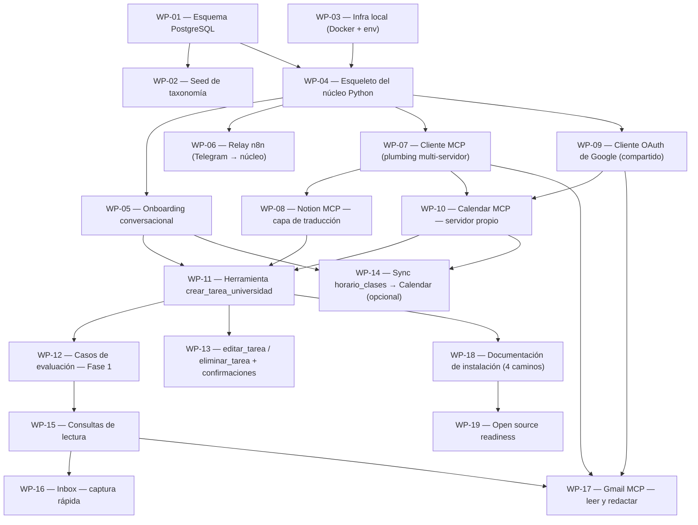

# ROADMAP

> Generado por `generate_map.py`. No editar a mano — regenerar desde el frontmatter de los PRDs.

| ID | Título | Estado | Progreso | Tamaño | Depende de | Camino crítico |
|---|---|---|---|---|---|---|
| WP-01 | Esquema PostgreSQL | skeleton | 0/13 | L | — | sí |
| WP-02 | Seed de taxonomía | skeleton | 0/5 | S | WP-01 |  |
| WP-03 | Infra local (Docker + env) | skeleton | 0/5 | S | — |  |
| WP-04 | Esqueleto del núcleo Python | skeleton | 0/8 | M | WP-01, WP-03 | sí |
| WP-05 | Onboarding conversacional | skeleton | 0/13 | L | WP-04 |  |
| WP-06 | Relay n8n (Telegram → núcleo) | skeleton | 0/5 | S | WP-04 |  |
| WP-07 | Cliente MCP (plumbing multi-servidor) | skeleton | 0/8 | M | WP-04 | sí |
| WP-08 | Notion MCP — capa de traducción | skeleton | 0/13 | L | WP-07 | sí |
| WP-09 | Cliente OAuth de Google (compartido) | skeleton | 0/5 | S | WP-04 |  |
| WP-10 | Calendar MCP — servidor propio | skeleton | 0/8 | M | WP-09, WP-07 |  |
| WP-11 | Herramienta crear_tarea_universidad | skeleton | 0/8 | M | WP-08, WP-10, WP-05 | sí |
| WP-12 | Casos de evaluación — Fase 1 | skeleton | 0/5 | S | WP-11 | sí |
| WP-13 | editar_tarea / eliminar_tarea + confirmaciones | skeleton | 0/13 | L | WP-11 |  |
| WP-14 | Sync horario_clases → Calendar (opcional) | skeleton | 0/5 | S | WP-05, WP-10 |  |
| WP-15 | Consultas de lectura | skeleton | 0/13 | L | WP-12 | sí |
| WP-16 | Inbox — captura rápida | skeleton | 0/5 | S | WP-15 |  |
| WP-17 | Gmail MCP — leer y redactar | skeleton | 0/8 | M | WP-09, WP-07, WP-15 | sí |
| WP-18 | Documentación de instalación (4 caminos) | skeleton | 0/8 | M | WP-11 |  |
| WP-19 | Open source readiness | skeleton | 0/5 | S | WP-18 |  |
